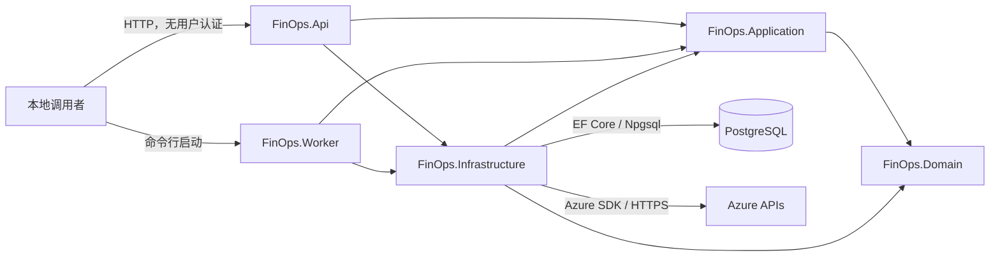
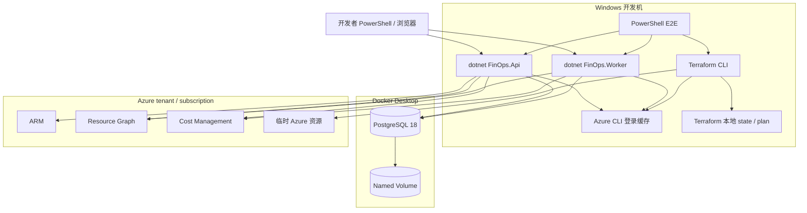
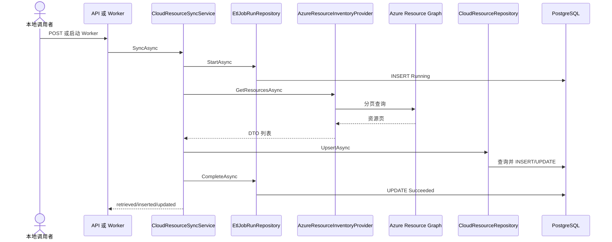
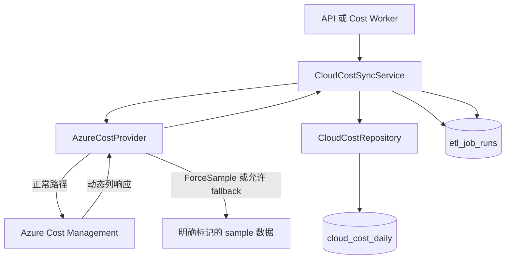

# 03 ★★★ Day 10：当前架构、数据流与信任边界

> 本日目标：只描述当前 Day 1～9 已被验证的系统，不画未来目标架构。
>
> 本日不做：重构代码、选择最终部署平台、设计完整生产多租户架构。

## 1. 完成定义

Day 10 完成时，应当存在一份 `docs/phase-0/current-architecture.md`，至少包含：

- 当前代码组件图；
- 当前本地部署图；
- Terraform 控制流；
- subscription 查询数据流；
- 资源清单 ETL 数据流；
- 成本 ETL 数据流；
- 成本查询数据流；
- 配置与身份来源；
- trust boundary；
- 当前安全、数据和运行缺口；
- 每个图节点到代码文件的映射。

所有图必须回答：

```text
谁发起？
通过什么协议或进程边界？
使用什么身份？
传递什么数据？
写到哪里？
失败留下什么状态？
当前有什么保护，缺少什么保护？
```

## 2. 前置条件

- Day 8 能力基线已通过人工 review；
- Day 9 基线验收有结果；
- 当前 Commit 已记录；
- 对 Day 9 失败或外部阻断不隐瞒；
- 已阅读高风险入口：
  - `src/FinOps.Api/Program.cs`
  - `src/FinOps.Worker/Program.cs`
  - `src/FinOps.Worker/Worker.cs`
  - `src/FinOps.Infrastructure/DependencyInjection.cs`
  - `src/FinOps.Infrastructure/Persistence/FinOpsDbContext.cs`
  - `terraform/azure/main.tf`

## 3. 建议文档结构

```text
docs/phase-0/current-architecture.md
├── 文档范围与 Commit
├── 系统上下文
├── 代码组件图
├── 本地部署图
├── Terraform 控制流
├── Subscription 查询流
├── Resource Inventory ETL
├── Resource ETL 失败流
├── Cost ETL 与 sample 分支
├── Cost Query 流
├── 配置与身份来源
├── Trust Boundary
├── 数据存储与分类提示
├── 当前单点与隐式耦合
└── 后续阶段映射
```

图使用 Mermaid，文字负责补充 Mermaid 无法表达的身份、协议、数据和失败语义。

## 4. 施工步骤

### 4.1 建立组件清单

逐项确认：

| 组件 | 当前职责 | 主要入口 |
| --- | --- | --- |
| `FinOps.Api` | HTTP、health、管理同步、成本查询、启动 migration | `Program.cs` |
| `FinOps.Worker` | 一次性 Resource/Cost Job、启动 migration、退出码 | `Worker.cs` |
| `FinOps.Application` | 同步和查询用例、Provider/Repository ports | `Cloud/*Service.cs` |
| `FinOps.Domain` | Resource、Cost、ETL 状态不变量 | 三个领域目录 |
| `FinOps.Infrastructure` | Azure SDK、HTTP、EF Core、Npgsql、DI | `DependencyInjection.cs` |
| PostgreSQL | 资源、成本、ETL 运行历史 | `FinOpsDbContext` |
| Azure ARM | subscription 和 tenant 枚举 | `ArmClient` |
| Azure Resource Graph | 资源清单 | `AzureResourceInventoryProvider` |
| Azure Cost Management | 成本查询 | `AzureCostProvider` |
| Terraform AzureRM | 测试基础设施生命周期 | `terraform/azure` |
| Docker Compose | 本地 PostgreSQL | `compose.yaml` |
| PowerShell E2E | 启动、验证、失败注入和清理 | `scripts/` |

### 4.2 绘制当前代码组件图

建议起点：



人工核对：

- Application 只引用 Domain；
- Azure SDK 只在 Infrastructure；
- API/Worker 作为 composition root 引用 Infrastructure；
- migration 当前由 API 和 Worker 启动；
- 图中不能出现尚不存在的 React、Service Bus consumer、OIDC 或 AWS。

### 4.3 绘制当前本地部署图

至少包含：



必须注明：

- 当前只有 local 环境；
- PostgreSQL 通过宿主端口暴露；
- 默认密码只用于本地；
- Azure CLI 是开发者用户身份，不是 production workload identity；
- Terraform state 存在于本地；
- E2E 会短暂创建真实资源。

### 4.4 绘制 Terraform 控制流

控制流：

```text
开发者
  → PowerShell 生命周期脚本
  → Azure CLI 预检
  → Terraform init/fmt/validate/plan/apply
  → Azure Resource Manager
  → 资源与 Queue 验证
  → Terraform destroy
  → state 与 Resource Group 双重清理验证
```

记录：

- 身份：当前 Azure CLI / AzureRM Provider 默认凭据链；
- 协议：CLI 进程调用与 Azure HTTPS API；
- 数据：Terraform configuration、plan、state、outputs；
- 敏感性：state 可能包含资源属性；
- 当前控制：`.gitignore`、destroy、state list、group exists；
- 缺口：remote state、locking、审批、drift、生产保护。

### 4.5 绘制 Subscription 查询流

```text
调用者
  → GET /api/cloud/azure/subscriptions
  → IAzureSubscriptionReader
  → AzureSubscriptionReader
  → ArmClient / DefaultAzureCredential
  → Azure ARM
  → AzureSubscriptionDto
  → JSON response
```

必须标记：

- 当前 endpoint 无用户认证；
- Azure 身份来自 API 进程的 credential chain；
- DTO 不暴露 Azure SDK 类型；
- 当前错误进入通用异常处理；
- 当前无 rate limit、audit 和 tenant scope。

### 4.6 绘制 Resource ETL 成功流



补充：

- 唯一身份为当前 schema 中的 provider + normalized resource ID；
- `FirstSeenAt` 保留、`LastSeenAt` 更新；
- 当前无 scan ID 和 inactive/deleted；
- 当前无 tenant；
- 当前全量结果在内存中处理的规模限制要记录。

### 4.7 绘制 Resource ETL 失败流

至少说明：

```text
Provider 或 Repository 抛出异常
  → SyncService 尝试把 Job 标记 Failed
  → API 返回当前错误
  → Worker 设置非零 ExitCode
```

人工核对：

- 失败状态是否使用独立 DbContext 保存；
- 若数据库本身不可用，失败状态可能无法保存；
- 当前没有错误分类、retry、lease、dead-letter 或 operator replay；
- 当前管理 API 无授权和审计。

### 4.8 绘制 Cost ETL 分支

必须清楚画出真实与 sample 两条分支：



必须注明：

- `ForceSampleData` 是测试开关；
- `UseSampleDataWhenUnavailable` 当前默认 `true`；
- sample 在 `raw_json.source` 中标记；
- 当前 fallback 仍可能掩盖真实 Provider 不可用；
- production 阶段必须物理禁止 fallback；
- 当前成本维度是日、服务、Resource Group、币种，不是精确单资源成本。

### 4.9 绘制 Cost Query 流

```text
GET /api/costs/*
  → CloudCostQueryService
  → 日期和 Provider 默认/校验
  → CloudCostQueryRepository
  → PostgreSQL 聚合
  → 按币种返回 daily 或 breakdown
```

注明：

- 当前默认 Azure、最近 7 天；
- 百分比按币种隔离；
- 当前无用户授权、tenant filter、分页或 rate limit；
- 当前查询数据可能包含 sample。

### 4.10 建立 trust boundary 表

至少包含：

| 边界 | 跨边界主体 | 身份 | 数据 | 当前控制 | 主要缺口 |
| --- | --- | --- | --- | --- | --- |
| 调用者 → API | 本地用户/脚本 | 无用户认证 | 查询、同步参数 | 本地端口 | auth/RBAC/audit |
| API/Worker → PostgreSQL | 应用进程 | 开发用户名密码 | 资源、成本、Job | connection string | secret store/least privilege/TLS |
| API/Worker → Azure | 应用进程 | Azure CLI credential | subscription、resource、cost | Azure RBAC | workload identity/scope |
| Terraform → Azure | Terraform CLI | 当前 Azure 身份 | IaC plan/state/资源 | tags/destroy | remote state/approval |
| Host → Docker | 本地进程 | 端口和数据库凭据 | SQL 数据 | Docker network/port | 网络隔离 |
| Git → 本地运行 | 开发者 | Git 身份 | 源代码和配置 | `.gitignore` | secret scanner/CI |
| 测试 → tmp/TEMP | 脚本 | OS 用户 | 日志、证据 | finally 清理 | 敏感日志保留策略 |

## 5. 节点到代码映射

每个图节点至少链接一个真实文件。例如：

| 图节点 | 代码或配置 |
| --- | --- |
| API routes | `src/FinOps.Api/Program.cs` |
| Worker dispatch | `src/FinOps.Worker/Worker.cs` |
| Resource use case | `CloudResourceSyncService.cs` |
| Cost use case | `CloudCostSyncService.cs` |
| Resource Graph | `AzureResourceInventoryProvider.cs` |
| Cost Management | `AzureCostProvider.cs` |
| PostgreSQL model | `FinOpsDbContext.cs` + Configurations |
| Terraform | `terraform/azure/*.tf` |
| E2E | `scripts/*.ps1` |

发现图中节点无法映射到代码时：

- 如果只是未来规划，删除该节点；
- 如果是隐式依赖，补充代码或配置证据；
- 如果文档声明错误，回到 Day 8 修正能力基线。

## 6. 自动验收

### 6.1 Mermaid 机械检查

若当前 IDE 或 Markdown renderer 支持 Mermaid，逐图预览。至少确认：

- 无语法错误；
- 节点文字可读；
- sequence participant 完整；
- 图没有引用不存在的服务；
- 箭头方向与调用方向一致。

阶段 1 再将 Mermaid 检查加入自动化静态门禁。

### 6.2 文件与引用

```powershell
Test-Path docs/phase-0/current-architecture.md
rg -n "Program.cs|Worker.cs|DependencyInjection.cs|FinOpsDbContext" `
  docs/phase-0/current-architecture.md
git diff --check
```

### 6.3 代码反查

```powershell
rg -n "ProjectReference" src -g '*.csproj'
rg -n "Map(Get|Post)|MigrateAsync" src/FinOps.Api src/FinOps.Worker
rg -n "DefaultAzureCredential|ArmClient|AddHttpClient" src/FinOps.Infrastructure
rg -n "UseNpgsql|AddDbContextFactory" src/FinOps.Infrastructure
```

图必须与搜索结果一致。

## 7. 人工验证

### 7.1 Walkthrough

由 reviewer 任选一个真实场景，沿图逐节点走读：

1. 从 API 手工触发资源同步；
2. Worker 执行成本同步；
3. Azure 身份失败；
4. PostgreSQL 不可用；
5. Terraform apply 后 destroy。

每一步应能指出：

- 进入哪个类或方法；
- 使用哪个身份；
- 访问哪个外部系统；
- 写哪个表；
- 成功返回什么；
- 失败记录在哪里；
- 当前缺少什么生产控制。

### 7.2 Trust boundary 复核

重点检查：

- 是否遗漏 Azure CLI token cache；
- 是否遗漏 Terraform state；
- 是否遗漏 `$env:TEMP` 日志；
- 是否把 Docker volume 当作短暂数据；
- 是否把管理 API 误认为内部安全接口；
- 是否把 Azure tenant 当成业务 tenant；
- 是否遗漏 sample 数据流。

### 7.3 当前图与目标图分离

当前图不得包含：

- OIDC；
- tenant context；
- Scheduler；
- distributed lease；
- Service Bus event consumer；
- React；
- OpenTelemetry backend；
- staging/production；
- AWS。

这些只能在“后续阶段映射”中列出，不能画成已部署组件。

## 8. Day 10 Review 清单

- [ ] 组件图与 `.csproj` 依赖一致；
- [ ] 部署图只画当前 local；
- [ ] API 和 Worker 自动 migration 已标出；
- [ ] 管理 API 无认证已标出；
- [ ] Azure CLI 开发身份已标出；
- [ ] Terraform 与运行时 ETL 是两条独立控制流；
- [ ] Resource ETL 成功和失败流都存在；
- [ ] Cost 真实与 sample 分支明确分开；
- [ ] 每条外部流有协议、身份和数据；
- [ ] PostgreSQL 表和写入者明确；
- [ ] trust boundary 表完整；
- [ ] 图中不存在未来组件；
- [ ] 每个节点能映射到当前文件；
- [ ] Day 9 外部阻断和限制如实写入。

## 9. 人工学习

### 9.1 C4 与数据流的区别

- 系统上下文：系统与用户、Azure、数据库等外部对象的关系；
- Container/组件：API、Worker、Application、Infrastructure 等职责；
- 部署图：进程实际运行在哪里；
- 数据流图：某类数据如何进入、转换、存储和返回；
- Trust boundary：身份、权限或管理责任发生变化的边界。

一张“漂亮架构图”不能替代这些不同视角。

### 9.2 必须回答

1. 为什么 Terraform 不属于 API 的运行时调用链？
2. API 和 Worker 为什么都引用 Infrastructure？
3. Application 为什么不能引用 Azure SDK？
4. 当前失败状态在哪些情况下可能无法持久化？
5. sample 数据从哪里产生，如何进入数据库？
6. Resource Graph 的资源数据和 Cost Management 成本数据能否直接一一对应？
7. 当前最危险的三个 trust boundary 是什么？
8. 为什么当前部署图不能画 staging 和 production？

### 9.3 白板复述

不看源代码，画出：

```text
一次资源同步
一次成本同步
一次成本查询
一次 Terraform 生命周期
```

然后为每条箭头标记身份和协议。无法完成时，Day 10 继续保持 `Validation`。

## 10. 收尾

在 `tmp/day10-closeout-report.md` 记录：

- 新增了哪些图；
- 哪些图经过真实运行反查；
- 发现了哪些隐式依赖；
- 哪些风险进入 Day 11；
- 哪些目标组件被明确排除在当前图之外；
- 人工 review 是否允许进入 Day 11。
