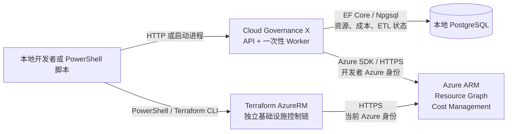
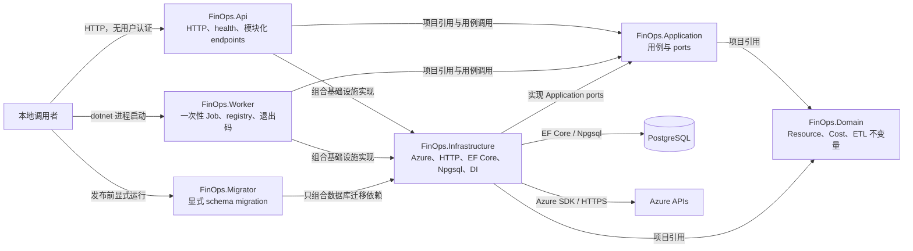
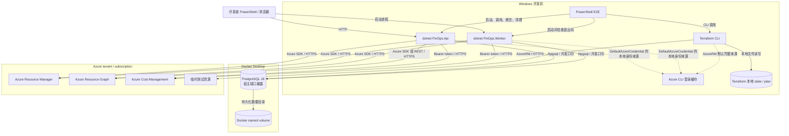
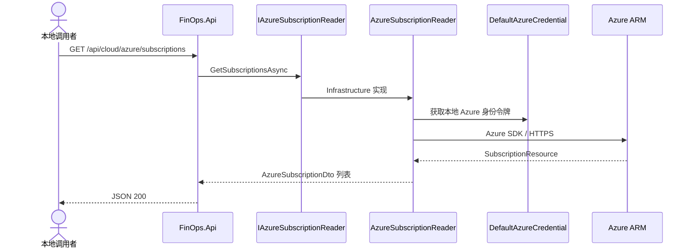
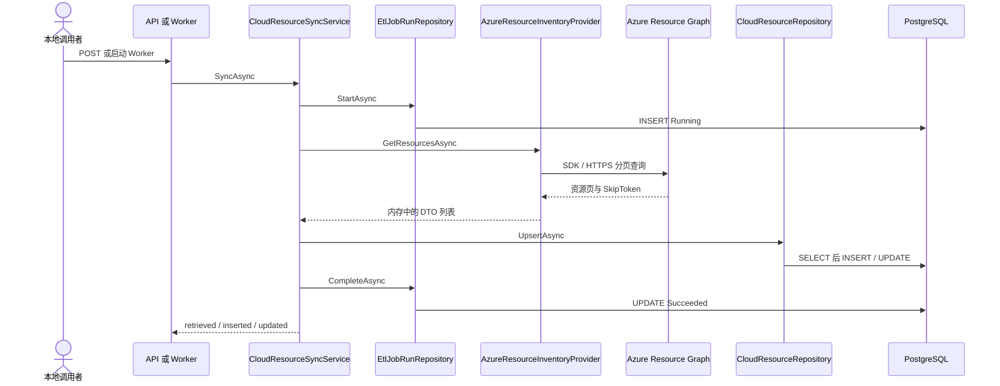
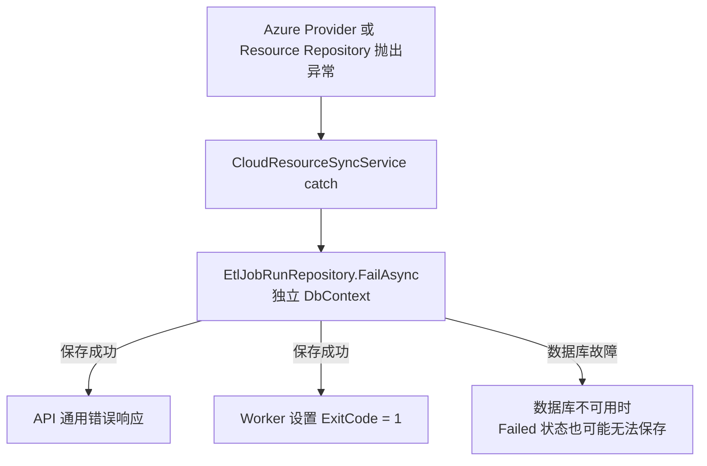
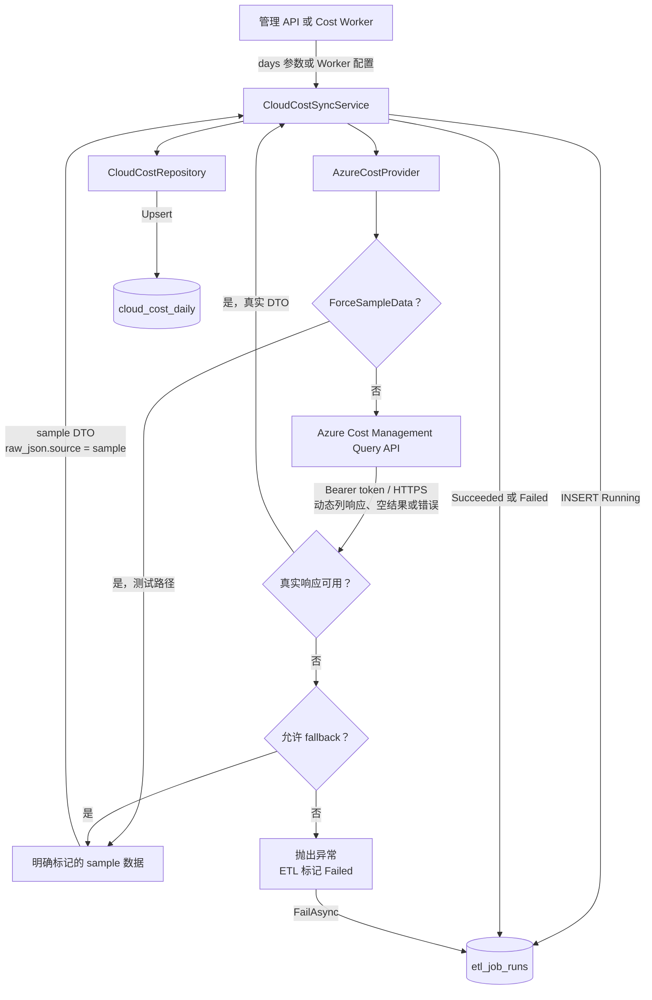
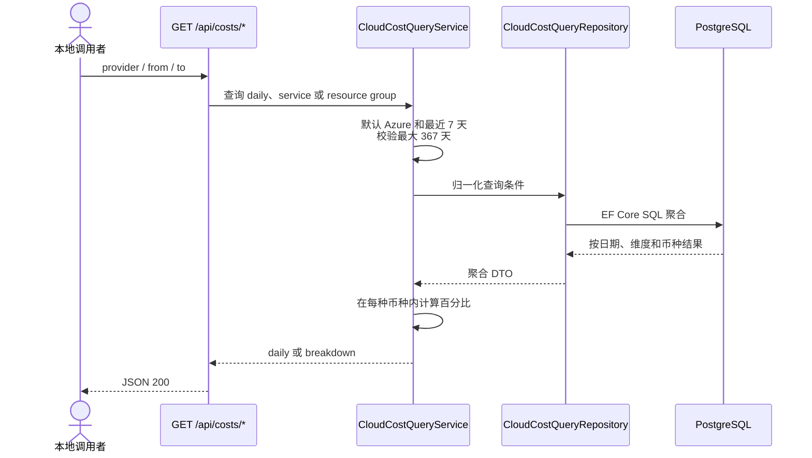

# 当前架构、数据流与信任边界

> 历史快照说明：本文冻结记录 Day 10 对 Day 1～9 系统的审计结果，不会随
> Phase 1 的结构重构逐项改写。Day 12～18 已新增静态门禁、架构测试、模块化
> endpoints/DI/Worker Job，以及独立 `FinOps.Migrator`；当前运行和配置方式以
> README、配置指南及 ADR-0001/ADR-0002 为准。

## 1. 文档范围

- 架构快照日期：2026 年 6 月 14 日
- 架构基线 Commit：`3c5dbd4`
- 运行证据：Day 9 六条 E2E 与严格真实成本复验均通过
- 当前环境：仅本地开发环境
- Day 10 状态：`ReadyForReview`

本文只描述 Day 1～9 已实现、已静态反查且在 Day 9 重新运行验证的系统。
OIDC、业务 tenant、调度器、分布式租约、Service Bus 消费者、React、
OpenTelemetry 后端、staging/production 和 AWS 均不是当前组件。

## 2. 系统上下文

运行时 ETL 和 Terraform 是两条独立控制链。API/Worker 不调用 Terraform；
Terraform 创建的 Service Bus Queue 当前也没有生产者或消费者。

## 3. 代码组件

编译依赖以 `.csproj` 为准：Application 只引用 Domain；Infrastructure 引用
Application 与 Domain；API、Worker 作为 composition root 同时引用 Application
与 Infrastructure；Migrator 只引用 Infrastructure。Azure SDK 只存在于
Infrastructure，只有 Migrator 可以调用 EF Core schema API。

## 4. 当前本地部署

当前 Azure 身份是开发者用户身份，不是 production workload identity。数据库
默认密码只允许本机开发；named volume 是持久数据，不应被视作临时内存。

## 5. Terraform 控制流

```mermaid
flowchart LR
    Operator["开发者"]
    Script["Test-AzureTerraformLifecycle.ps1"]
    Preflight["Azure CLI 预检"]
    Terraform["init / fmt / validate<br/>plan / apply"]
    Arm["Azure Resource Manager"]
    Verify["资源与 Queue 验证"]
    Destroy["terraform destroy"]
    Cleanup["state 为空<br/>Resource Group 不存在"]

    Operator -->|"PowerShell"| Script
    Script -->|"az CLI"| Preflight
    Preflight -->|"当前 Azure 身份"| Terraform
    Terraform -->|"AzureRM / HTTPS"| Arm
    Arm -->|"资源属性与 outputs"| Verify
    Verify --> Destroy
    Destroy -->|"AzureRM / HTTPS"| Arm
    Destroy --> Cleanup
```

- 数据：Terraform configuration、plan、state、outputs 与 Azure 资源属性。
- 当前控制：`.gitignore`、脚本 `finally` 清理、`state list` 与资源组双重核验。
- 主要缺口：remote state、locking、审批、drift 检测和生产删除保护。
- 敏感性：本地 state 可能保存资源标识和属性，不得提交 Git。

## 6. Subscription 查询流

该 endpoint 当前无用户认证、授权、审计、rate limit 或业务 tenant scope。
DTO 隔离了 Azure SDK 类型；异常进入 ASP.NET Core 通用异常处理。

## 7. Resource Inventory ETL

### 7.1 成功流

资源唯一身份是 `(provider, resource_id_normalized)`。重复同步保留
`FirstSeenAt` 并更新 `LastSeenAt`。当前没有 scan ID、inactive/deleted 语义、
业务 tenant、checkpoint 或流式写入；所有分页结果先累积到内存。

### 7.2 失败流

当前没有错误分类、自动 retry、分布式 lease、dead-letter 或 operator replay。
管理同步 API 匿名且没有审计，是当前高风险入口。

## 8. Cost ETL

- `ForceSampleData` 是测试开关。
- `UseSampleDataWhenUnavailable` 当前默认 `true`，只适合本地学习与演示。
- Day 9 另行关闭 fallback，取得 28 行真实成本，证明真实路径可用。
- fallback 可能掩盖权限、账单或 Provider 故障；生产必须物理禁止。
- 当前粒度为日、服务、Resource Group、币种，不代表精确单资源成本。

## 9. Cost Query 流

当前无用户授权、tenant filter、分页或 rate limit。返回数据可能来自 sample，
调用者必须结合来源字段和 ETL 运行证据判断数据真实性。

## 10. 配置与身份来源

| 对象 | 当前来源 | 使用者 | 覆盖方式 | 生产结论 |
| --- | --- | --- | --- | --- |
| PostgreSQL | `appsettings.json` 开发默认值 | API、Worker | `PostgreSql__*` 环境变量 | 明文开发口令禁止生产 |
| Azure tenant hint | `Azure:TenantId`，默认空 | `DefaultAzureCredential` | `Azure__TenantId` | 不是业务 tenant |
| Azure runtime 身份 | Azure CLI 登录缓存等默认链 | API、Worker | Azure Identity 环境与宿主配置 | 必须改为 workload identity |
| Terraform 身份 | AzureRM 默认凭据链 | Terraform CLI | Provider/环境配置 | 当前是开发者身份 |
| Cost fallback | `AzureCost` 配置 | API、Worker | `AzureCost__*` | 生产必须关闭并强制校验 |
| Worker Job | `Etl:Job`、`Etl:CostDays` | Worker | `Etl__*` | 当前仅手工一次性运行 |
| Compose 数据库 | `.env` 或 compose 默认值 | PostgreSQL 容器 | 未提交的 `.env` | 仅本机开发 |

## 11. 数据存储与分类提示

| 存储 | 写入者 | 主要数据 | 保留与完整性 | 分类提示 |
| --- | --- | --- | --- | --- |
| `cloud_resources` | `CloudResourceRepository` | Azure 资源 ID、订阅、资源组、区域、tags | 唯一键保证幂等；无删除语义 | 资产元数据，tags 可能含组织信息 |
| `cloud_cost_daily` | `CloudCostRepository` | 订阅、日期、服务、资源组、金额、币种、原始 JSON | 业务唯一键 Upsert；可能含 sample | 财务与账单数据 |
| `etl_job_runs` | `EtlJobRunRepository` | Job、时间、状态、数量、错误消息 | 每次操作使用独立 DbContext | 运行审计；错误可能泄漏外部细节 |
| Docker named volume | PostgreSQL | 上述三表与 migration 历史 | `docker compose down` 不删除 | 本地持久数据 |
| Terraform state/plan | Terraform CLI | 资源标识、属性和 outputs | 本地文件，Git 忽略 | 基础设施敏感元数据 |
| `tmp/` 与 `$env:TEMP` | E2E 脚本 | 日志、断言和运行证据 | Git 忽略，脚本负责清理 | 可能含订阅和资源标识 |

## 12. Trust Boundary

| 边界 | 协议/进程边界 | 身份 | 数据 | 当前控制 | 主要缺口 |
| --- | --- | --- | --- | --- | --- |
| 调用者 → API | HTTP | 无用户认证 | 查询与同步参数 | 默认本地端口 | auth、RBAC、audit、TLS、rate limit |
| 调用者 → Worker | OS 进程 | 当前 OS 用户 | Job 与日期参数 | 本地命令行 | 调度、授权、并发控制 |
| API/Worker → PostgreSQL | TCP、Npgsql | 开发用户名密码 | 资源、成本、Job | connection string、readiness | secret store、TLS、最小权限、HA |
| API/Worker → Azure | Azure SDK/REST、HTTPS | Azure CLI credential chain | 订阅、资源、成本 | Azure RBAC | workload identity、最小 scope、审计 |
| Terraform → Azure | CLI、AzureRM、HTTPS | 当前 Azure 身份 | plan/state/资源 | tags、destroy 与清理核验 | remote state、locking、审批、drift |
| Host → Docker | 宿主端口 | 数据库凭据 | SQL 数据 | Docker 与端口映射 | 网络隔离、证书、访问收敛 |
| Git → 本地运行 | Git 与文件系统 | Git/OS 用户 | 源码和配置 | `.gitignore` | secret scanner、CI 门禁 |
| 测试 → `tmp`/TEMP | OS 文件系统 | OS 用户 | 日志与证据 | `finally` 清理、Git 忽略 | 保留期、脱敏与集中证据库 |

最危险的当前边界是匿名管理 API、开发者 Azure 身份进入运行时，以及明文开发
数据库凭据。它们在本地闭环中可接受，但都明确禁止直接沿用到生产。

## 13. 单点、失败语义与隐式耦合

| 事实 | 当前影响 |
| --- | --- |
| migration 必须由独立 Migrator 显式执行 | 业务宿主不持有 DDL 职责；发布遗漏 Migrator 时 schema 不会自动升级 |
| 单 PostgreSQL 实例和单 named volume | 数据库不可用时查询、同步和失败审计一起受影响 |
| ETL 由匿名 API 或手工 Worker 触发 | 无可靠调度、租约、幂等触发键和并发治理 |
| Azure CLI 是 runtime 与 Terraform 的身份来源 | 开发者会话、订阅选择和权限直接影响系统行为 |
| Resource Graph 结果全量放入内存 | 资源规模扩大后有内存和执行时长风险 |
| Cost fallback 默认开启 | 外部故障可能被样例成功路径掩盖 |
| `etl_job_runs` 使用独立 DbContext | 业务写入失败后通常仍可记 Failed；数据库整体故障时不能保证 |
| API 路由已拆为 endpoint modules | `Program.cs` 仅负责组合；仍缺版本、授权、分页和 OpenAPI 治理 |
| Terraform 使用本地 state | 无团队锁、集中审计和灾难恢复 |

## 14. 图节点到代码映射

| 图节点 | 当前文件 |
| --- | --- |
| API composition root | [`src/FinOps.Api/Program.cs`](../../src/FinOps.Api/Program.cs) |
| API routes 与 health | [`src/FinOps.Api/Endpoints`](../../src/FinOps.Api/Endpoints) |
| Worker lifecycle 与退出码 | [`src/FinOps.Worker/Worker.cs`](../../src/FinOps.Worker/Worker.cs) |
| Worker Job registry/dispatch | [`src/FinOps.Worker/Jobs`](../../src/FinOps.Worker/Jobs) |
| 独立 migration | [`src/FinOps.Migrator/MigrationRunner.cs`](../../src/FinOps.Migrator/MigrationRunner.cs) |
| Infrastructure 注册与凭据 | [`src/FinOps.Infrastructure/DependencyInjection.cs`](../../src/FinOps.Infrastructure/DependencyInjection.cs) |
| Subscription reader | [`AzureSubscriptionReader.cs`](../../src/FinOps.Infrastructure/Azure/AzureSubscriptionReader.cs) |
| Resource Graph provider | [`AzureResourceInventoryProvider.cs`](../../src/FinOps.Infrastructure/Azure/AzureResourceInventoryProvider.cs) |
| Cost Management provider | [`AzureCostProvider.cs`](../../src/FinOps.Infrastructure/Azure/AzureCostProvider.cs) |
| Resource use case | [`CloudResourceSyncService.cs`](../../src/FinOps.Application/Cloud/CloudResourceSyncService.cs) |
| Cost sync use case | [`CloudCostSyncService.cs`](../../src/FinOps.Application/Cloud/CloudCostSyncService.cs) |
| Cost query use case | [`CloudCostQueryService.cs`](../../src/FinOps.Application/Cloud/CloudCostQueryService.cs) |
| PostgreSQL model | [`FinOpsDbContext.cs`](../../src/FinOps.Infrastructure/Persistence/FinOpsDbContext.cs) |
| Resource persistence | [`CloudResourceRepository.cs`](../../src/FinOps.Infrastructure/Persistence/CloudResourceRepository.cs) |
| Cost persistence与查询 | [`CloudCostRepository.cs`](../../src/FinOps.Infrastructure/Persistence/CloudCostRepository.cs)、[`CloudCostQueryRepository.cs`](../../src/FinOps.Infrastructure/Persistence/CloudCostQueryRepository.cs) |
| ETL 状态 persistence | [`EtlJobRunRepository.cs`](../../src/FinOps.Infrastructure/Persistence/EtlJobRunRepository.cs) |
| 本地 PostgreSQL | [`compose.yaml`](../../compose.yaml) |
| Terraform AzureRM | [`terraform/azure/main.tf`](../../terraform/azure/main.tf) |
| E2E 入口 | [`scripts/`](../../scripts/) |

## 15. 后续阶段映射

以下仅是缺口去向，不是当前部署组件：

| 当前缺口 | 后续阶段 |
| --- | --- |
| CI、架构规则、静态门禁 | 阶段 1 |
| OIDC、workload identity、授权 | 阶段 2 |
| 业务 tenant context 与数据隔离 | 阶段 3～4 |
| Resource checkpoint、失活与删除语义 | 阶段 5 |
| 生产成本语义与禁止 sample | 阶段 6 |
| Scheduler、distributed lease、重试与 replay | 阶段 7 |
| Service Bus 事件链 | 阶段 8 |
| React | 阶段 9 |
| OpenTelemetry 与可观测性后端 | 阶段 10 |
| staging/production 发布平台 | 阶段 12～15 |
| AWS | 后续 Provider 阶段 |

## 16. Day 11 输入

Day 11 应基于本文登记至少以下风险：匿名管理入口、开发者身份、明文开发口令、
单数据库、显式 migration 发布顺序、默认 sample fallback、本地 Terraform state、缺少
tenant、缺少 ETL 并发控制、资源全量内存处理，以及日志/state/原始 JSON 的
数据分类和保留策略。

人工 reviewer 应沿“资源同步、成本同步、成本查询、Azure 身份失败、PostgreSQL
不可用、Terraform apply/destroy”逐条走读。Day 10 在人工确认前保持
`ReadyForReview`，不提前宣称阶段 0 完成。
